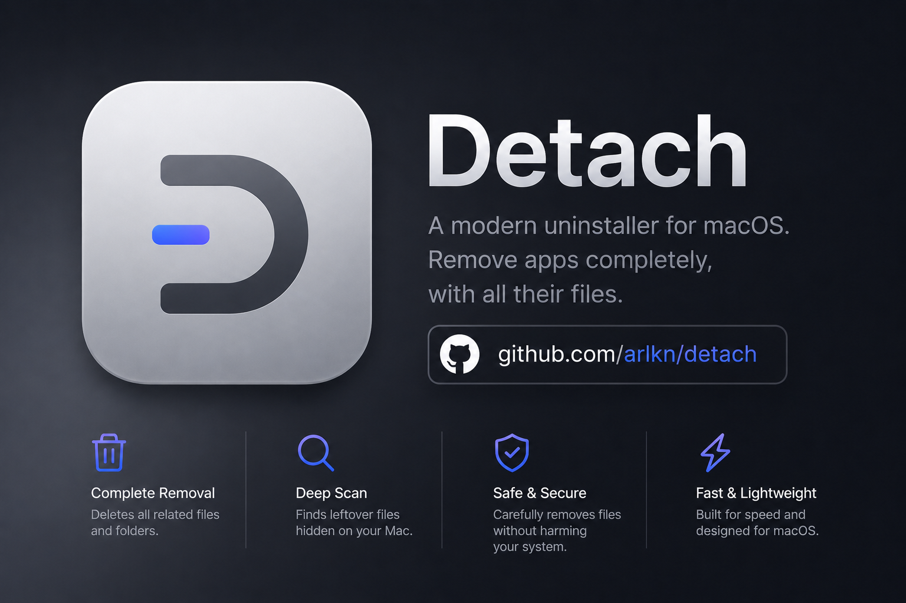
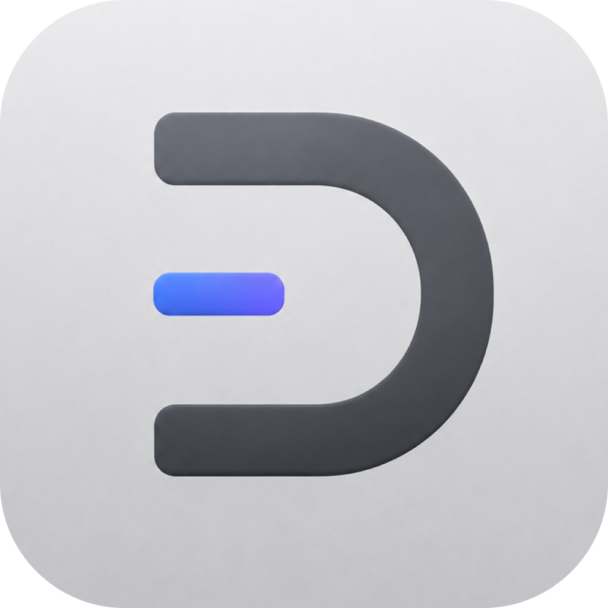

# Detach

Detach is a native macOS utility for uninstalling apps safely. It can remove only the app bundle, or move the app and matched related files to Trash with review, history, and restore support.


<p align="center">
  
</p>

<p align="center">
  <a href="https://github.com/arlkn/Detach/releases/latest/download/Detach.dmg">
    
  </a>
</p>
<p align="center">
  <strong>Click the icon to download the latest Detach DMG</strong>
</p>


### Homebrew 🍺

```bash
brew tap arlkn/detach https://github.com/arlkn/Detach.git
brew install --cask arlkn/detach/detach
```

## What Detach Does

- Lists apps from `/Applications` and `~/Applications`.
- Offers two uninstall modes: app-only or app with related files.
- Moves files to Trash to delete them.
- Shows risky, skipped, and admin-only matches separately.
- Saves removal history so moved items can be restored.

## Safety

- No permanent delete path.
- Second confirmation before removal.
- Low-confidence matches are never selected automatically.
- Protected Apple/system paths are left untouched.
- Admin-only items are separate and never selected by default.

## Build From Source

Open `Detach.xcodeproj` in Xcode, select the `Detach` scheme, configure signing, and run.

Command-line fallback:

```bash
./script/build_and_run.sh
```

Build only:

```bash
./script/build_and_run.sh --build-only
```

Create a DMG:

```bash
./script/package_dmg.sh
```

The DMG is written to:

```text
build/dist/Detach.dmg
```

## Distribution Note

Current public builds are ad-hoc signed and not notarized. macOS may show a Gatekeeper warning until Developer ID signing and notarization are added.

## Project Structure

- `Detach/Views`: SwiftUI app UI.
- `Detach/ViewModels`: app state and uninstall flow.
- `Detach/Models`: app, related-file, and manifest models.
- `Detach/Services`: scanning, Trash movement, history, restore, and permission services.
- `DetachTests`: unit tests for scanning, risk, manifests, restore, and deletion services.
- `Casks/detach.rb`: Homebrew cask for the release DMG.

## License

Detach is licensed under the [MIT License](LICENSE).
